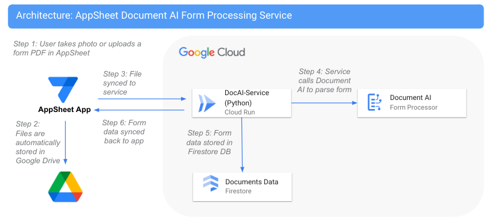

# AppSheet Document AI Adapter
This service provides an easy way to use the [Google Cloud Document AI](https://cloud.google.com/document-ai) form processor within AppSheet apps. This service can be deployed with one-click to [Google Cloud Run](https://cloud.google.com/run), where it serves as adapter between a No-Code AppSheet app, and the powerful form processing features of Document AI. 

Deployment and maintenance can be easily automated, with the minimal code provided in the service taking care of all of the logic needed to use Doc AI in AppSheet.

## Deploy

To deploy, simply click on this button to deploy into a chosen GCP project:

[](https://deploy.cloud.run)

View a complete deployment and usage guide: [Using Google Cloud Document AI with AppSheet]()

## Architecture
Here is a high level architecture diagram of the solution.



## Prerequisites
You should configure a Document AI form processor before deploying this service as described (here)[https://cloud.google.com/document-ai/docs/create-processor]. Save the processor region and id, since you will need to enter it when deploying the service. 

## Assets deployed
- [Google Cloud Run](https://cloud.google.com/run) service for processing files. 
- [Firestore](https://cloud.google.com/firestore) database for storing processed form data. 
- [Document AI](https://cloud.google.com/document-ai) 

The costs to run the solution should be minimal, since Cloud Run gives 2 million calls for free each month, and the [costs](https://cloud.google.com/document-ai/pricing) for Document AI form processing are reasonable for small volumes.

## Debug
You can deploy manually by cloning this repository, adding your project details into the deploy script, and calling the scripts in this order:

```bash
# Deploy solution
./1_deploy.sh

# Load a test data document, needed for AppSheet to connect to the API
./2_loaddata.sh

# Optionally du a curl test of the API endpoint
./3_test.sh
```

You can also debug the service locally using the VSCode debug configuration and setting the environment variables correctly.